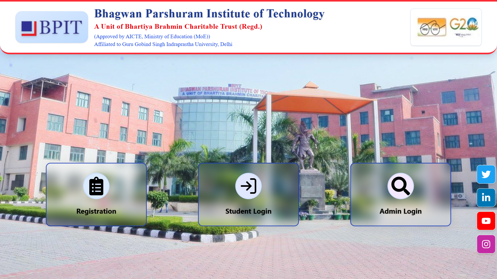
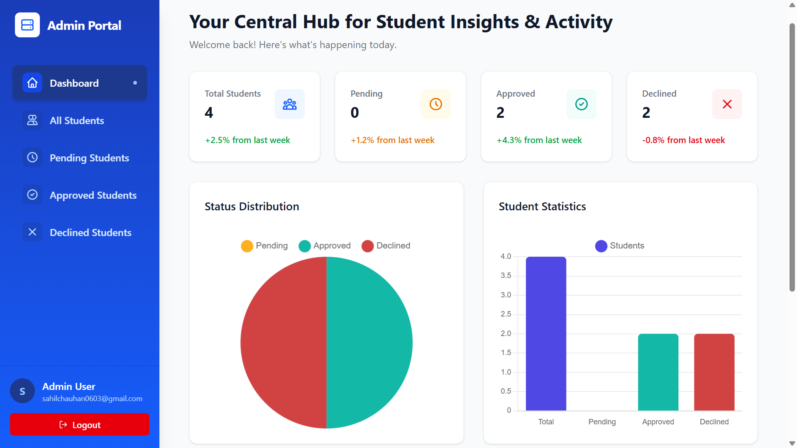

# BPIT CampusPro – ERP System - [🌐 Live Demo](https://erp-student-sm4v.onrender.com/)

A modern, full-stack ERP (Enterprise Resource Planning) system for Bhagwan Parshuram Institute of Technology (BPIT), designed to streamline student registration, administration, and dashboard management for students, faculty, and administrators.

---

## 🚀 Features

- **Student Registration:**  
  Multi-step, responsive registration for students, faculty, and non-teaching staff with document upload and review.

- **Admin Panel:**  
  - Secure admin login with OTP authentication.
  - Dashboard with statistics and charts.
  - Manage all student applications: view, approve, decline, and review details.
  - Color-coded status (approved, pending, declined).
  - Pagination for all student tables (10 per page).
  - Responsive sidebar showing logged-in admin’s email.
  - SweetAlert2 pop-ups for all important actions and errors.

- **Student Dashboard:**  
  - View personal, academic, and parent details in a clean, card-based layout.
  - Color-coded status and detail cards with readable date formats.
  - Update declined fields and resubmit for review.
  - Receive email notifications on status changes and profile updates.

- **Authentication & Security:**  
  - JWT-based authentication with HttpOnly cookies.
  - Secure backend endpoints with role-based access.
  - OTP-based login for both students and admins.

- **Responsive UI:**  
  - Fully responsive design for all pages (admin, student, registration, login).
  - Consistent color theme and modern UI using Tailwind CSS.

- **Notifications:**  
  - Email notifications for registration, approval, decline, and profile updates.
  - SweetAlert2 pop-ups for user feedback.

- **Other:**  
  - Favicon and branding.

---

## 🛠️ Tech Stack

### Frontend
- **React** (with Hooks)
- **Vite** (for fast development)
- **Tailwind CSS** (utility-first, responsive styling)
- **SweetAlert2** (modern pop-ups)
- **Chart.js** (dashboard charts)
- **Axios** (API requests)
- **React Router** (routing)

### Backend
- **Node.js** + **Express.js**
- **MySQL** (relational database)
- **JWT** (authentication)
- **Nodemailer** (email notifications)
- **Cloudinary** (document/image uploads)
- **dotenv** (environment variables)

---

## 🤔 Why This Tech Stack?

- **React + Vite:** Fast, modern, and component-based UI development with hot module reload and great DX.
- **Tailwind CSS:** Rapid, consistent, and responsive styling with utility classes.
- **Express + Node.js:** Lightweight, flexible, and widely adopted for REST APIs.
- **MySQL:** Reliable, relational data storage for structured student/admin data.
- **JWT + HttpOnly Cookies:** Secure, stateless authentication.
- **SweetAlert2:** User-friendly, attractive pop-ups for all feedback and alerts.
- **Cloudinary:** Hassle-free, scalable file and image uploads.
- **Nodemailer:** Reliable email delivery for notifications and OTPs.

---

## 📦 Project Structure

```
newERP/
  client/         # Frontend (React, Vite, Tailwind)
    src/
      components/
      pages/
      assets/
      ...
    public/
    index.html
    package.json
    ...
  server/         # Backend (Node.js, Express, MySQL)
    controllers/
    routes/
    config/
    utils/
    ...
  README.md       # Project documentation
```

---

## ⚙️ Setup & Installation

### Prerequisites
- Node.js (v16+ recommended)
- MySQL server
- Cloudinary account (for uploads)
- Email SMTP credentials (for notifications)

### 1. Clone the repository
```bash
git clone https://github.com/yourusername/ERP_Student.git
cd ERP_Student
```

### 2. Setup the Backend

```bash
cd server
npm install
# Configure .env with DB, JWT, Cloudinary, and email credentials
npm start
```

### 3. Setup the Frontend

```bash
cd ../client
npm install
npm run dev
```

### 4. Access the App

- Student Portal: `https://erp-student-sm4v.onrender.com/login`
- Admin Portal: `https://erp-student-sm4v.onrender.com/admin`

---

## 📧 Email & Notification Flows

- **On registration:** Student receives confirmation email.
- **On admin approval/decline:** Student receives status email.
- **On student profile update (after decline):** Student receives “profile resubmitted” email.
- **On logout:** User sees a “Back to Home?” pop-up, with a persistent info button if dismissed.

---

## State Management in this project

State management in this project, specifically for authentication, is handled using React's Context API, as demonstrated in the file.

Here's a detailed breakdown:

1.  **`AuthContext` Creation:**
    *   A context object named `AuthContext` is created using `createContext()`. This object will hold the current authentication state and related functions, making them accessible to any component wrapped within its provider.

2.  **`AuthProvider` Component:**
    *   This is a functional component that acts as the provider for the `AuthContext`. It wraps its `children` components, making the authentication state available to them.
    *   **State Variables:** It manages three pieces of state using `useState`:
        *   `isAuthenticated`: A boolean indicating whether a user is currently authenticated.
        *   `userRole`: A string (`'admin'` or `'student'`) indicating the role of the authenticated user, or `null` if no user is authenticated.
        *   `loading`: A boolean indicating whether the initial authentication check is still in progress.
    *   **`checkAuthStatus` Function:** This asynchronous function is responsible for verifying the user's authentication status with the backend. It makes two `axios` requests:
        *   First, it checks the `/admin/auth-check` endpoint. If an admin is authenticated, `isAuthenticated` is set to `true` and `userRole` to `'admin'`.
        *   If no admin is authenticated, it then checks the `/student/auth-check` endpoint. If a student is authenticated, `isAuthenticated` is set to `true` and `userRole` to `'student'`.
        *   If neither is authenticated, `isAuthenticated` is set to `false` and `userRole` to `null`.
    *   **`useEffect` Hook:** This hook runs `checkAuthStatus` once when the `AuthProvider` component mounts. It sets `loading` to `false` after the authentication check is complete, ensuring that components waiting for authentication status don't render prematurely.
    *   **`logout` Function:** This function handles user logout. It sends a `POST` request to either the `/admin/logout` or `/student/logout` endpoint based on the user's role. After a successful logout (or even if there's an error during the request), it navigates the user to the appropriate login page and then updates the `isAuthenticated` and `userRole` states.
    *   **Context Value:** The `value` object passed to `AuthContext.Provider` includes `isAuthenticated`, `userRole`, `loading`, `logout`, and `checkAuthStatus`. This makes these states and functions available to all consuming components.

3.  **`useAuth` Custom Hook:**
    *   This custom hook simplifies consuming the `AuthContext`. Components can call `useAuth()` to get direct access to the `isAuthenticated`, `userRole`, `loading`, `logout`, and `checkAuthStatus` values without needing to import `AuthContext` and `useContext` directly in every component.
    *   It also includes a check to ensure that `useAuth` is called within an `AuthProvider`, preventing common errors.

In summary, this setup centralizes authentication state management, making it easily accessible and manageable across the entire React application while keeping components clean and focused on their presentation logic.

---

## React-Context vs React-redux

Both React Context and Redux are powerful tools for state management in React applications, but they serve different purposes and have distinct characteristics. Here's a detailed comparison:

### **React Context API**

**What it is:**
React Context provides a way to pass data through the component tree without having to pass props down manually at every level. It's designed to share data that can be considered "global" for a tree of React components, such as the current authenticated user, theme, or preferred language.

**Key Characteristics:**
*   **Simplicity:** It's built into React, so no additional libraries are needed. It's relatively straightforward to set up for simpler state sharing needs.
*   **Direct Data Flow:** Data flows directly from the Provider to the Consumers. When the Provider's value changes, all consuming components re-render.
*   **Use Cases:** Best suited for less frequently updated data or data that is truly global and doesn't require complex state logic (e.g., authentication status, theme toggles, user preferences).
*   **Performance Considerations:** If a Context Provider's value changes frequently, all components consuming that context will re-render, which can lead to performance issues in large applications. This can be mitigated to some extent with `React.memo` or by splitting contexts.
*   **No Central Store:** There isn't a single, centralized store. Each context creates its own independent "slice" of global state.
*   **No Middleware/DevTools:** By itself, Context API doesn't offer features like middleware for side effects (e.g., async operations) or dedicated developer tools for state inspection and time-travel debugging.

**When to use it:**
*   For sharing simple, global data like themes, user authentication status, or language preferences.
*   When you want to avoid prop drilling for a few specific props.
*   For small to medium-sized applications where state management complexity is low.

### **React Redux**

**What it is:**
Redux is a predictable state container for JavaScript apps. It's a standalone library that can be used with any UI layer (like React) and is based on the Flux architecture. Redux centralizes your application's state and logic, making it easier to manage and debug.

**Key Characteristics:**
*   **Centralized Store:** Redux maintains a single, immutable state tree (the "store") for the entire application. All state changes go through this single source of truth.
*   **Predictable State Changes:** State changes are made through "actions" (plain JavaScript objects describing what happened) and processed by "reducers" (pure functions that take the current state and an action, and return a new state). This makes state changes highly predictable and testable.
*   **Middleware Support:** Redux has a robust middleware system that allows for handling side effects (like asynchronous API calls), logging, and other cross-cutting concerns. Libraries like Redux Thunk or Redux Saga are commonly used for async operations.
*   **Developer Tools:** Redux DevTools provide powerful features for inspecting state, replaying actions, and time-travel debugging, which are invaluable for complex applications.
*   **Scalability:** Redux is designed for large and complex applications with many interacting parts and frequent state updates. Its strict patterns enforce a clear separation of concerns.
*   **Learning Curve:** Redux has a steeper learning curve due to its core concepts (actions, reducers, store, middleware) and boilerplate code, although modern Redux Toolkit significantly reduces this.
*   **Performance Considerations:** Redux can be highly optimized for performance, as components only re-render when the specific slice of state they are subscribed to changes.

**When to use it:**
*   For large-scale applications with complex state logic and frequent updates.
*   When you need a single source of truth for your application's state.
*   When you require powerful debugging tools and predictable state changes.
*   When dealing with complex asynchronous operations and side effects.
*   When multiple components need to share and update the same state, and prop drilling becomes unmanageable.

### Key Differences Summarized:

| Feature             | React Context API                               | React Redux                                                              |
| :------------------ | :---------------------------------------------- | :----------------------------------------------------------------------- |
| **Purpose**         | Simple state sharing for global data.           | Centralized, predictable state management for complex applications.      |
| **Complexity**      | Lower setup and boilerplate.                    | Higher learning curve, more boilerplate (reduced by Redux Toolkit).      |
| **Data Flow**       | Direct from Provider to Consumer.               | Unidirectional data flow (Actions -> Reducers -> Store -> Components).   |
| **Central Store**   | No single central store; multiple contexts possible. | Single, immutable central store.                                         |
| **Middleware**      | No built-in middleware support.                 | Extensive middleware ecosystem for side effects, logging, etc.           |
| **DevTools**        | No dedicated dev tools.                         | Powerful DevTools for time-travel debugging, state inspection.           |
| **Performance**     | Can lead to unnecessary re-renders if not optimized. | Optimized for performance; components re-render only on relevant state changes. |
| **Use Cases**       | Theming, authentication status, user preferences. | E-commerce, social media feeds, complex forms, real-time dashboards.     |

In your current project, the use of React Context for authentication (`AuthContext.jsx`) is a good example of using Context for a global, relatively stable piece of state that needs to be accessed by many components without prop drilling. It's a suitable choice for this specific use case, as authentication status doesn't typically change very frequently or involve complex state transitions that would necessitate the full power of Redux.

---

## 🖼️ Screenshots

### HomePage


### Admin Panel


### Student Dashboard


### Student Login Page


### Admin Login Page


---

## 📄 License

This project is for educational purposes. All rights reserved © BPIT.

---

## 🙏 Acknowledgements

- BPIT for the use case and branding.
- [Vite](https://vitejs.dev/), [React](https://react.dev/), [Tailwind CSS](https://tailwindcss.com/), [SweetAlert2](https://sweetalert2.github.io/), [Cloudinary](https://cloudinary.com/), [Nodemailer](https://nodemailer.com/), and all open-source contributors.
